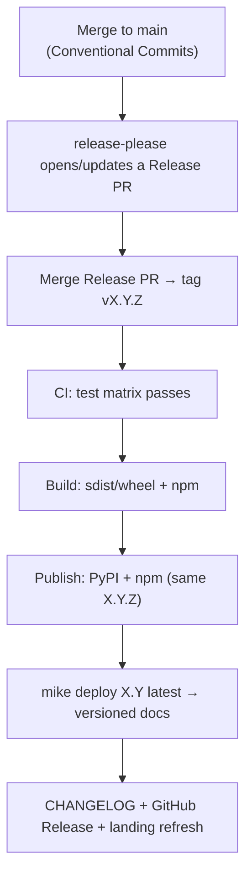

# Releasing — docs ship with the release

Conjure's defining release principle: **a package release *is* a docs release.** One tag
publishes the Python package, the npm package, **and** that version's documentation. There's
no separate "update the docs" step to forget.

## The pipeline



Because `mike deploy` lives **in the same pipeline**, publishing a package always publishes
its docs. No manual docs step.

## Versioning

- **SemVer.** The REST contract (`/conjure/*` + the schema JSON) is the public API; breaking
  it is a major bump.
- **Single version source.** The root version is shared by the Python package, the npm
  package, and the docs; the Python and npm packages **always ship the same `X.Y.Z`** so the
  backend/frontend contract stays in lock-step.
- **Deprecations.** Warn for one minor, remove in the next major; document in a deprecation
  table.

## Versioned docs with `mike`

`mike` keeps a deployed copy of the docs per version so a user reading the `0.1` docs sees
`0.1` behaviour. The version switcher in the header is wired by
`extra.version.provider: mike` in `mkdocs.yml`.

```bash
# Deploy a version and point the "latest" alias at it
mike deploy 0.1 latest --update-aliases

# Make "latest" the default a visitor lands on
mike set-default latest

# Preview the deployed site locally
mike serve

# Inspect / remove versions
mike list
mike delete 0.0
```

In CI the release job runs the deploy for you:

```yaml title=".github/workflows/release.yml (excerpt)"
- run: pip install -r apps/docs/requirements.txt
- run: python apps/docs/gen/gen_config_reference.py   # refresh generated tables
- run: mike deploy --push --update-aliases ${{ steps.ver.outputs.minor }} latest
  working-directory: apps/docs
```

## Code → docs generators

A headline feature: reference docs are **generated from the code**, so they can't drift.
The generators live in `apps/docs/gen/` and run in CI before `mkdocs build`.

| Generator | Produces | Source | Status |
|---|---|---|---|
| `gen_config_reference.py` | `reference/_generated_config.md` (settings table) | `conjure/conf.py` `DEFAULTS` dict (AST-parsed); falls back to the authored table | <span class="status available">✅</span> |
| `gen_openapi.py` | REST API reference | drf-spectacular OpenAPI of the running API | <span class="status planned">📋</span> |
| `gen_cli.py` | CLI reference | management command `--help` capture | <span class="status planned">📋</span> |

### How the config generator works

`gen_config_reference.py` **parses** `packages/conjure/conjure/conf.py` with Python's `ast`
module (no import, no Django setup — so it runs anywhere, even without dependencies
installed). It finds the `CONJURE_DEFAULTS` or `DEFAULTS` dict, flattens nested dicts into
dotted keys (`BRAND.name`), pairs each key with a human description, and writes a Markdown
table to `docs/reference/_generated_config.md`. If `conf.py` isn't present, it falls back to
the authored settings table so the docs always build. `reference/configuration.md` pulls the
result in with a snippet include:

```markdown
--8<-- "reference/_generated_config.md"
```

Run it locally before serving:

```bash
python apps/docs/gen/gen_config_reference.py
```

CI runs the same command so the published table always matches the shipped `conf.py`. See
[the generators README](#code-docs-generators) — full details live in `apps/docs/gen/README.md`.

## CI workflows

| Workflow | Trigger | Jobs |
|---|---|---|
| `ci.yml` | PR / push | Python test matrix, lint, web `tsc`+build+tests, **docs build check** |
| `docs.yml` | main push | Build docs → preview deploy (`mike deploy dev`) |
| `release.yml` | tag `v*` | Build → PyPI (OIDC) + npm (provenance) → `mike deploy X.Y latest` → GitHub Release |
| `pr-docs-gate` | PR | Flag feature PRs that change no docs/CHANGELOG |

Security: PyPI via **Trusted Publishing** (OIDC, tokenless), npm with `--provenance`,
Dependabot, and a `SECURITY.md` disclosure path.

## Release checklist (mostly automated)

- [ ] Test matrix green
- [ ] Release PR merged → tag created
- [ ] PyPI + npm published at the same `X.Y.Z`
- [ ] `mike deploy X.Y latest` ran (versioned docs live)
- [ ] CHANGELOG + GitHub Release notes generated
- [ ] Landing site refreshed
