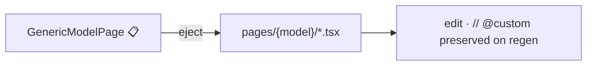

# Extension points

The contract for extending Conjure **without forking**. Each extension point is a public
registry or hook; you add capabilities by registering, never by patching the core.

## The extension points

| Extension point | What you add | How | Status |
|---|---|---|---|
| **Field type renderer** | Custom field / GFK / GIS display & input | `@register_field("MyField")` — backend schema + frontend renderer **pair** | <span class="status setup">🟡</span> |
| **Widget** | Dashboard card / chart | `@register_widget("name")` + frontend widget component | <span class="status available">✅</span> |
| **Action** | Export, issue, send, refund | `ADMIN_ACTIONS` declaration + `sync_admin_actions` (permission) + handler | <span class="status planned">📋</span> |
| **`AdminConfig` attribute** | Per-model behaviour | Declare on the registered config class | <span class="status available">✅</span> |
| **Page eject** | Fully custom screen | Runtime → codegen `.tsx`, then own it | <span class="status available">✅</span> |

> Each extension point is documented **with an example** here and in the relevant guide, so
> the "how to add a feature" path stays current with the code.

## Field type renderer

Register **both halves** — the backend describes the field in the schema; the frontend
renders it. Without the pair, the field shows as raw text.

=== "Backend"

    ```python
    from conjure import register_field

    @register_field("ColorField")
    def color_field_schema(field):
        return {
            "type": "color",          # frontend renderer key
            "control": "color-picker",
            "nullable": field.null,
        }
    ```

=== "Frontend"

    ```tsx
    // in your scaffolded dashboard (the code `npx @terracelab/conjure-web init` generated)
    import { registerFieldRenderer } from "@/lib/field-renderers";

    registerFieldRenderer("color", {
      cell: ({ value }) => <span style={{ background: value }} className="swatch" />,
      control: ColorPickerControl,
    });
    ```

## Widget

```python title="backend — conjure/widgets.py or your app"
from conjure import register_widget

@register_widget("revenue-trend")
def revenue_trend(request):
    qs = Order.objects.filter(status="paid")
    return {"series": monthly_totals(qs)}
```

```tsx title="frontend — pages/dashboard/index.tsx"
const data = useQuery(queryKeys.widget("revenue-trend"),
                      () => adminApi.widget("revenue-trend"));
// render with Recharts
```

Served at `GET /conjure/widgets/revenue-trend/`. See the
[REST API reference](../reference/rest-api.md#widgets).

## Action

<span class="status planned">📋</span> Three pieces — declaration, permission sync, handler:

```python title="conjure/actions.py"
ADMIN_ACTIONS = [
    {"model": "order.Order", "codename": "refund", "name": "Refund",
     "kind": "server", "scope": "bulk", "variant": "danger", "confirm": "Refund selected orders?"},
]
```

```bash
python manage.py sync_admin_actions   # creates order.refund permission (no migration)
```

The handler (dispatched by codename on `POST /conjure/r/order.Order/action/refund/`)
performs the refund, returns a partial-failure report, and writes an audit entry. Full
design: [Actions & permissions](../actions-permissions/index.md).

## `AdminConfig` attributes

The everyday extension point — already available. Curate list/form/inline behaviour per
model. See [Registering models](../guides/registering-models.md) for the full attribute set.

## Page eject

Pull a runtime-rendered page into codegen you own:



See [Custom pages](../guides/custom-pages.md).

## Contributing a new extension point

If you're adding a new *kind* of hook to Conjure itself (not just using one), see
[Extension development](../contributing/extension-development.md) for the registry
conventions, the backend/frontend pairing rule, and the docs-with-example requirement.
