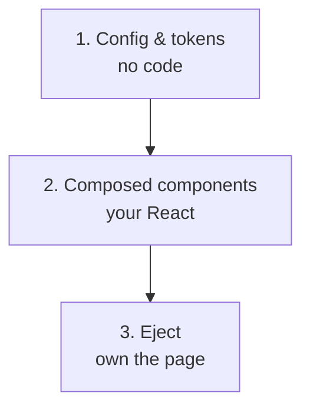
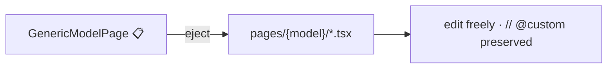

# Customization

Conjure is built to be extended **without forking**. There are three layers of
customization, from "change a color" to "own the whole screen", plus a plugin SDK for
adding capabilities through public hooks.

## The three layers



1. **Config & tokens** — theme colors via env, behaviour via `AdminConfig`. No code.
2. **Composed components** — build variants in `components/composed/` and use them in
   generated pages.
3. **Eject** — pull a runtime page into codegen `.tsx` and own it outright.

## Composed components

The compact UI primitives in `components/ui/` are **frozen** — don't edit them, so the kit
stays consistent. Build your variants in `components/composed/` and register each on the
`/style-guide` page (a project convention that keeps the catalog complete).

```text
components/ui/        ← frozen primitives (32px density)  — do not edit
components/composed/  ← DataTable, FkCombobox, InlineTable, ActionBar 📋, your additions
```

The composed vocabulary you'll reuse: `DataTable`, `FkCombobox`, `InlineTable`,
`ConfirmDeleteDialog`, `StatusBadge`, `MoneyCell`, `DeltaCell`, `EntityLink`, `DateCell`,
`BoolCell`, `ThumbCell`, `FilterBar`, `StatCard`, `EmptyState`, `FormRow`,
`ImageUploadField`.

## Eject a page

The hybrid model: most models render via the [runtime renderer](../getting-started/first-screen.md)
<span class="status planned">📋</span>; eject the few that need bespoke UI.



Ejecting generates the codegen page set for one model and routes to it. From then on it's
ordinary React in your repo — see [Custom pages](../guides/custom-pages.md) for the file
layout and the `// @custom` preservation contract.

## Plugin SDK

Add capabilities through public registries instead of patching the core. Each hook has a
backend half and (where relevant) a frontend half.

### `register_field` — custom field types

Support a custom/GFK/GIS field by registering a schema describer and a renderer pair. See
[Field support → adding a field type](../reference/field-support.md#adding-a-field-type).

```python
from conjure import register_field

@register_field("ColorField")
def color_field_schema(field):
    return {"type": "color", "control": "color-picker"}
```

### `register_widget` — dashboard widgets

Add a dashboard card or chart:

```python title="backend"
from conjure import register_widget

@register_widget("revenue-trend")
def revenue_trend(request):
    return {"series": [...]}   # served at GET /conjure/widgets/revenue-trend/
```

```tsx title="frontend — pages/dashboard/index.tsx"
const data = adminApi.widget("revenue-trend");
// render with Recharts
```

### `ADMIN_ACTIONS` — actions (spells)

<span class="status planned">📋</span> Declare actions once; gate them by role; enforce on
the server. See [Actions & permissions](../actions-permissions/index.md).

```python title="conjure/actions.py (design)"
ADMIN_ACTIONS = [
    {"model": "order.Order", "codename": "refund", "name": "Refund",
     "kind": "server", "scope": "bulk", "variant": "danger"},
]
```

```bash
python manage.py sync_admin_actions   # creates the permission (no migration)
```

### `AdminConfig` attributes — per-model behaviour

The everyday hook: curate columns, search, filters, inlines, and read-only state per model.
See [Registering models](../guides/registering-models.md).

## Which hook for which goal

| I want to… | Use |
|---|---|
| Change brand color / density | [Tokens & env](../guides/theming.md) |
| Curate a model's list/form | [`AdminConfig`](../guides/registering-models.md) |
| Render a custom field type | [`register_field`](extension-points.md) |
| Add a dashboard card/chart | [`register_widget`](extension-points.md) |
| Add export / refund / push | [`ADMIN_ACTIONS`](../actions-permissions/index.md) 📋 |
| Fully redesign one screen | [Eject → custom page](../guides/custom-pages.md) |

Full registry contracts are on the next page: [Extension points](extension-points.md).
