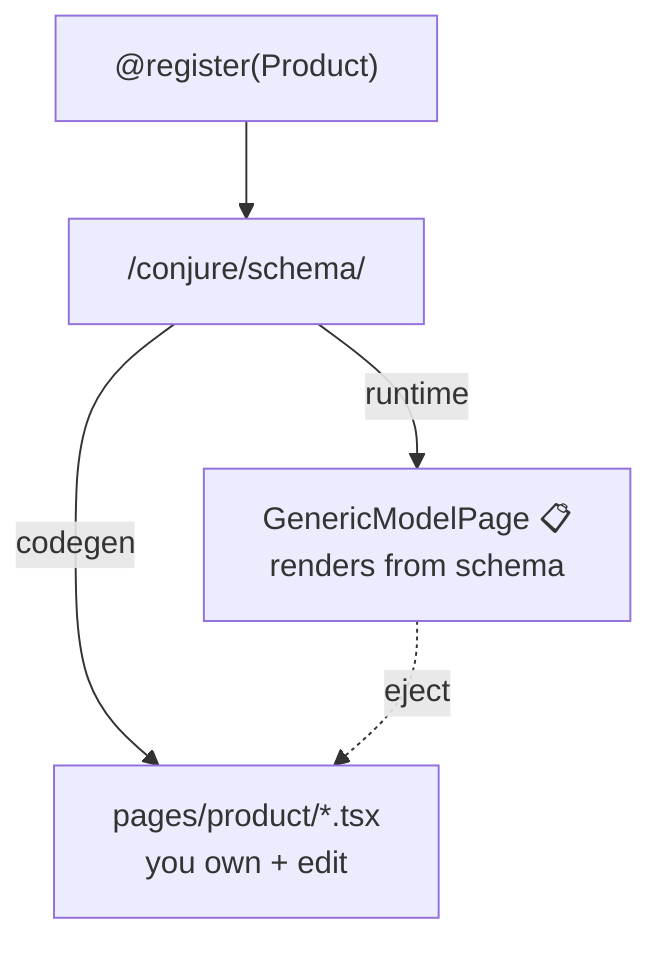

# Your first screen

You've registered a model. Now choose how it becomes a screen. Conjure offers two modes
that read the **same** introspection schema, so you can mix them per page.

=== "Runtime mode (zero build)"

    <span class="status planned">📋 planned</span> The bundled SPA will render any registered
    model from the live schema. You write **no frontend code**.

    ```bash
    python manage.py collectstatic   # serve the bundled SPA once (planned)
    ```

    Open `http://localhost:8000/admin-panel/`, log in with an `is_staff` account, and your
    model appears in the sidebar. The runtime renderer covers list (search and filter), create,
    edit, and delete (plus inline children) straight from the schema.

    **Best for:** getting an admin up today, internal tools, models that don't need a
    bespoke UI.

=== "Codegen mode (own the React)"

    <span class="status available">✅ available</span> Scaffold plain React pages from the
    schema, then edit them like any other code in your repo.

    ```bash
    # scaffold the dashboard into your project, then own + build it:
    python manage.py conjure_dump_schema > schema-snapshot.json
    npx @terracelab/conjure-web init conjure-admin
    cd conjure-admin && pnpm install && pnpm build   # tsc strict + vite
    ```

    Each model gets a small page set (`schema`, `columns`, `index`, `form`, `detail`).
    They're ordinary `.tsx` files — change a cell, add a button, restyle a form.

    **Best for:** customer-facing or heavily-customized screens you want to **own**.

## How they relate



Both paths start at the same schema endpoint. The recommended workflow is **hybrid**:
let runtime mode cover most models, and **eject** the few that need to be special into
codegen pages you own. See [Custom pages](../guides/custom-pages.md) for the eject flow.

## Authentication: session vs JWT

The dashboard authenticates the way you configure `CONJURE["AUTH"]`.

=== "Session (default)"

    Reuses your existing Django login. Nothing extra to deploy — if the user has a Django
    session and `is_staff`, they're in.

    ```python title="settings.py"
    CONJURE = {"AUTH": "session"}
    ```

    Best when the admin lives on the same domain as your Django app.

=== "JWT"

    Staff-only access tokens via SimpleJWT, for a separately-hosted SPA (S3 + CDN).

    ```python title="settings.py"
    CONJURE = {"AUTH": "jwt"}
    ```

    The dashboard calls `POST /conjure/auth/login/`, stores the token, and the API client
    refreshes on 401 automatically. See the [REST API reference](../reference/rest-api.md).

## Verify the screen

1. Log in with an `is_staff` account.
2. Find your model in the sidebar (runtime) or open its route (codegen).
3. Search and filter a column, then create, edit, and delete a row — both codegen pages and
   runtime mode support full CRUD (runtime builds the form from the schema).
4. If you ran `migrate conjure`, the **audit log** now shows your writes with a diff.

From here, make it yours: [theme it](../guides/theming.md),
[organize the sidebar](../guides/sections-and-tabs.md), or
[customize a page](../guides/custom-pages.md).
