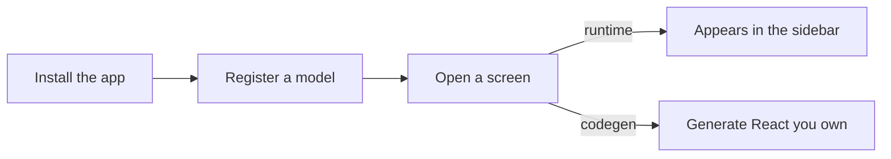

# Getting started

Conjure turns a Django model into an admin screen in three short steps. This section
walks the whole path; budget about five minutes.

## The path

1. **[Installation](installation.md)** — `pip install django-conjure`, add it to
   `INSTALLED_APPS`, wire up `urls.py`, and run one migration for the audit log.
2. **[Your first model](first-model.md)** — create an `admin_config.py`, register a model
   with `@register`, and curate its list/search/filter behaviour.
3. **[Your first screen](first-screen.md)** — choose **runtime mode** (zero frontend
   build) or **codegen mode** (own the React), and open the dashboard.

## What you'll have at the end

A staff-only admin at your chosen URL with:

- A model list with server-side **search, filter, sort, and pagination**.
- **Create / edit / delete** forms generated from the model schema.
- Permissions enforced by your existing Django `Group` / `Permission` / `is_staff` — no
  second auth system.
- An **audit log** of every write (who changed what, with a diff).

## Before you begin

You need an existing Django project with:

- Django 4.2 LTS or 5.x, Django REST Framework 3.15+, Python 3.10+.
- At least one **`is_staff=True`** user to log in with.
- `django.contrib.auth` installed (it almost certainly is — it's the only hard
  dependency Conjure adds beyond DRF).

!!! note "Conjure does not touch your models"
    Registering a model is read-only introspection. Conjure adds exactly one table of its
    own (`AdminAuditLog`); your existing migrations are never modified.
