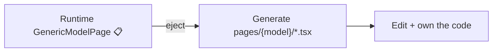

# Custom pages

Conjure's promise is **you own the output**. In codegen mode every screen is plain React
in your repo. This guide covers editing generated pages, preserving your edits across
regeneration, and ejecting a runtime page into code.

## Anatomy of a generated page

Each model in codegen mode produces a small, predictable page set under
`web/src/pages/{model-kebab}/`:

| File | Responsibility |
|---|---|
| `schema.ts` | The model's field metadata (from the schema snapshot). |
| `columns.tsx` | Column definitions for the list `DataTable`. |
| `index.tsx` | The list page (search / filter / sort / bulk). |
| `form.tsx` | The create / edit form (zod-validated). |
| `detail.tsx` | The detail view (+ inline child editors). |

Read-only models get a 3-file variant (no `form.tsx`; detail is a dialog).

## Editing a page

These are ordinary `.tsx` files — change them freely. Common edits:

- **Replace a cell.** In `columns.tsx`, swap a column's `cell` renderer (e.g. tint an
  order total with a custom cell instead of `MoneyCell`).
- **Add a header button.** Add to the list `PageHeader actions` or the bulk bar.
- **Tweak a form field.** Reorder, add help text, or wire a custom widget in `form.tsx`.

```tsx title="pages/order/columns.tsx"
// @custom: total column tinted red when refunded (1)
{
  accessorKey: "total",
  header: "Total",
  cell: ({ row }) => (
    <MoneyCell value={row.original.total} tone={row.original.refunded ? "loss" : "default"} />
  ),
}
```

1.  The `// @custom:` marker is the contract — see below.

## Preserving edits across regeneration

When a model's fields change, you re-dump the schema and regenerate the page. To keep your
hand edits, mark them:

```tsx
// @custom: describe what you changed and why
```

Put the marker at the top of a file (whole-file ownership) or above a block. On
regeneration the codegen step performs a **diff merge** and preserves anything tagged
`// @custom`.

!!! warning "Commit before regenerating"
    The merge is diff-based. Always `git commit` your custom edits before re-running
    codegen so you have a clean rollback.

## Ejecting a runtime page

The hybrid workflow: let [runtime mode](../getting-started/first-screen.md) render most
models, then **eject** the few that need to be special.



Eject = generate the codegen page set for that one model and route to it instead of the
generic renderer. From then on it's your code. The rest of the admin keeps running on the
runtime renderer untouched. See [Customization → eject](../customization/index.md#eject-a-page).

## New composed components

The compact UI kit under `components/ui/` is **frozen** — don't edit it. Build variants in
`components/composed/` and register them on the `/style-guide` page (this is a project
convention so the catalog stays complete).

```text
components/ui/        ← frozen primitives (compact, 32px density)
components/composed/  ← DataTable, FkCombobox, InlineTable, your additions
```

## Dashboard widgets

To add a dashboard card or chart:

1. Write a function in the backend `widgets.py` and register it (`@register_widget`).
2. Add the card/chart to `pages/dashboard/index.tsx`, calling
   `adminApi.widget("name")`.

Widgets use Recharts. See [Extension points](../customization/extension-points.md) for the
registry contract.
