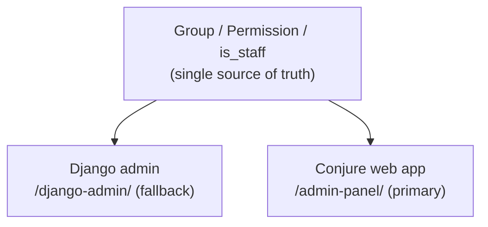

# Migrating from Django admin

You don't have to choose between Django admin and Conjure. They **coexist** on the same
permissions, so you can run both, migrate gradually, and keep Django admin as a fallback.

## Shared permissions

The headline: both admins read the **same** `Group` / `Permission` / `is_staff` data. There
is no second permission system to keep in sync.



Manage permissions in one place (the Django admin Group editor) and both surfaces honour
them.

## What's shared and what isn't

| Concern | Behaviour |
|---|---|
| Permission source | **Shared** — same `Group` / `Permission`. Manage once. |
| CRUD permissions | Shared `view` / `add` / `change` / `delete`. Can't differ per UI (same codename). |
| Staff gate | Both require `is_staff`. Superusers pass everything in both. |
| Action lists | **Not shared** — `ModelAdmin.actions` and Conjure's `ADMIN_ACTIONS` are independent. |
| Audit log | Conjure's `AdminAuditLog` records Conjure writes; Django admin's `LogEntry` is separate. |

!!! warning "CRUD permissions can't diverge per UI"
    Because both UIs use the *same* `change_order` permission, you can't grant change in one
    UI and deny it in the other. If you need that, gate access to one UI itself (move Django
    admin to a restricted URL or require a dedicated access permission).

## A coexistence setup

A common arrangement: Conjure as the day-to-day admin, Django admin parked at a different
URL as an emergency fallback.

```python title="urls.py"
urlpatterns = [
    path("django-admin/", admin.site.urls),                  # fallback
    path("conjure/", include("conjure.urls")),               # API
    path("admin-panel/", include("conjure.spa_urls")),       # primary UI
]
```

Moving Django admin from `/admin/` to `/django-admin/` is a one-line change; unfold's
sidebar and redirects are reverse-based, so nothing else needs editing. Check operator
bookmarks and any admin-redirect middleware before flipping it in production.

## Porting your `ModelAdmin`s

`AdminConfig` is intentionally close to `ModelAdmin`. Most curation ports directly:

| `ModelAdmin` | `AdminConfig` |
|---|---|
| `list_display` | `list_display` (real model fields; move computed columns to a custom cell) |
| `search_fields` | `search_fields` |
| `list_filter` | `list_filter` |
| `ordering` | `ordering` |
| `inlines` | `inlines = [(Child, "fk_field")]` |
| `has_add/change/delete_permission = False` | `is_readonly = True` |
| `exclude` | `exclude` |

```python title="before — admin.py"
@admin.register(Product)
class ProductAdmin(admin.ModelAdmin):
    list_display = ["name", "price", "is_active"]
    search_fields = ["name"]
    list_filter = ["is_active"]
```

```python title="after — admin_config.py"
from conjure import register, AdminConfig

@register(Product)
class ProductConfig(AdminConfig):
    list_display = ["name", "price", "is_active"]
    search_fields = ["name"]
    list_filter = ["is_active"]
```

!!! tip "Keep computed columns out of `list_display`"
    Django admin lets you put methods in `list_display`. Conjure introspects real model
    fields, so move computed/derived columns to a frontend
    [custom cell](../guides/custom-pages.md) instead.

## A gradual path

1. Install Conjure alongside Django admin (both at their URLs).
2. Port `ModelAdmin`s to `admin_config.py` one app at a time.
3. Move Django admin to a fallback URL once parity feels right.
4. Decommission Django admin per a feature-parity checklist (Excel import/export, drag
   ordering, any admin-only pages) when you're ready — or keep it forever as a fallback.

## FAQ

??? question "Do I have to remove Django admin?"
    No. They share permissions and coexist indefinitely; keeping Django admin as an
    emergency fallback is a valid long-term choice.

??? question "Will registering a model in Conjure affect Django admin?"
    No. `admin_config.py` and `admin.py` are independent files; neither touches the other.

??? question "Do both admins log the same activity?"
    No. Conjure writes `AdminAuditLog`; Django admin writes `LogEntry`. They're separate
    histories.
