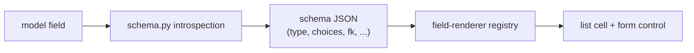

# Field support

Conjure introspects each model field and picks a **list cell** and a **form control** for
it automatically. This page is the mapping — the field type → control matrix.

!!! info "Generated in the future"
    <span class="status planned">📋</span> This matrix will eventually be generated from the
    field-renderer registry in code (the same registry `@register_field` extends), so it can
    never drift. Today it's maintained here; the renderer names are the actual composed
    components.

## Matrix

| Django field | List cell | Form control | Notes |
|---|---|---|---|
| `CharField`, `TextField` | text | text / textarea | `TextField` → multiline. |
| `CharField(choices=…)` | `StatusBadge` / display | select | Uses `{field}_display`. |
| `IntegerField`, `FloatField`, `DecimalField` | number (right-aligned) | number | |
| Money / amount decimals | `MoneyCell` | number | Currency-formatted; pair with `--gain`/`--loss` for deltas. |
| `BooleanField` | `BoolCell` | toggle / checkbox | |
| `DateField`, `DateTimeField` | `DateCell` | date / datetime picker | Range filters via `__gte`/`__lte`. |
| `ForeignKey` | `EntityLink` (+ `{fk}_label`) | `FkCombobox` | Debounced async search + infinite scroll. |
| `OneToOneField` | `EntityLink` | `FkCombobox` | |
| Reverse FK (children) | — | `InlineTable` | Declared via `inlines`; atomic save. |
| `ImageField`, `FileField` | `ThumbCell` | `ImageUploadField` | Multipart upload + XHR progress. |
| `EmailField`, `URLField` | text (linkified) | text | |
| `UUIDField` (pk) | text | read-only | PK routes adapt to string/UUID automatically. |
| `JSONField` | truncated text | textarea (JSON) | |
| Delta / change columns | `DeltaCell` | — | Computed display, finance colors. |
| `ManyToManyField` | — | — *(📋)* | Excluded in v1; multiselect on the roadmap. |

## How a field becomes a control



The backend describes the field in the schema JSON; the frontend's renderer registry maps
that description to a cell and a control. To support a custom field type, register **both
sides** — see below.

## Fields excluded by design

| Field | Why | Where it lands |
|---|---|---|
| `password` on User | Never round-trip a hash | Dropped from schema, responses, and forms. |
| `ManyToManyField` | No multiselect control in v1 | [Roadmap](../roadmap.md). |
| Computed admin columns | Not real model fields | Frontend custom cell / [custom page](../guides/custom-pages.md). |

## Adding a field type

For a custom field, GFK, or GIS field, register a renderer pair:

```python title="backend — describe the field in the schema"
from conjure import register_field

@register_field("MyField")
def my_field_schema(field):
    return {"type": "myfield", "control": "my-control"}
```

```tsx title="frontend — render the cell + control"
registerFieldRenderer("myfield", {
  cell: MyCell,
  control: MyControl,
});
```

See [Extension points](../customization/extension-points.md) for the full contract.
