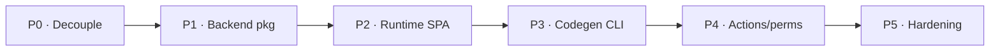

# Roadmap

Where Conjure is and where it's going. Status legend: ✅
available · 🟡 needs setup / decoupling ·
📋 planned / design.

## What's shipping today

The core was extracted from a production internal admin (75 models, ~150 routes). These are
battle-tested:

| Capability | Status |
|---|---|
| Model introspection / schema API | ✅ |
| Generic CRUD (list / retrieve / create / update / delete) | ✅ |
| Server-side search · filter · sort · pagination | ✅ |
| Bulk (delete / update / atomic inline) · autocomplete · related | ✅ |
| Audit log (diff of every write) | ✅ |
| Staff auth — JWT (session mode in packaging) | ✅ |
| Dashboard widgets (stats / trend / recent activity) | ✅ |
| Codegen pages + golden template | ✅ |
| Sections + tabs sidebar (manifest + assemble) | ✅ |
| Env theming, compact UI, `/style-guide` | ✅ |
| CSV export + selection export | ✅ |

## In progress / needs setup

| Capability | Status | Note |
|---|---|---|
| Package extraction (decouple from any one project) | 🟡 | Core is ready; `conf.py` layer landed. |
| Session auth mode + bundled SPA serving | 🟡 | Part of packaging. |

## Planned

| Capability | Status | Note |
|---|---|---|
| Runtime `GenericModelPage` (zero-codegen) | ✅ | Register a model → it appears with full list + create/edit/delete + inlines, no per-model code. |
| Actions & permissions system | 📋 | Design complete — see [the spec](actions-permissions/index.md). |
| `@terracelab/conjure-web init` CLI scaffolder | ✅ | Golden template + rules shipped as an `npx` scaffolder. |
| Real `.xlsx` export, M2M editing, column toggle, virtual scroll | 📋 | UX completeness. |
| Field plugin SDK, i18n (EN/KO), security defaults | 📋 | Hardening. |

## The phased plan (P0–P5)

| Phase | Theme | Contents |
|---|---|---|
| **P0** | Decouple | Settle project-specific knobs into settings → `conjure` as a standalone app. |
| **P1** | Backend package | `admin_config.py` auto-discovery, session auth, widget registry, bundled migrations, `pyproject`. |
| **P2** | Runtime SPA | `GenericModelPage` (schema-driven) + config endpoint (theme/nav) + bundle serving. |
| **P3** | Codegen CLI | Golden template + rules packaged as the `@terracelab/conjure-web init` scaffolder. |
| **P4** | Actions & permissions | `actions.py` + `sync_admin_actions` + action endpoint + `ActionBar`. ([spec](actions-permissions/index.md)) |
| **P5** | Hardening | Field plugin SDK, i18n (EN/KO), secure defaults, docs site, Django-version test matrix. |

## Further out

UX and platform ideas under consideration (not committed):

- **Lazy-loaded model pages** — `React.lazy` + dynamic imports for ~70% smaller initial
  load.
- **Read-only deep links** — `/m/{model}/{pk}` opens a detail dialog directly.
- **Date-range filter widget** — the `__gte`/`__lte` backend contract already exists.
- **Auth hardening** — short-lived access tokens, httpOnly cookies, login throttling.
- **Audit log upgrades** — retention policy, actor IP allowlist, better diff viewer.
- **Schema-drift guard** — CI warns when the schema snapshot changes (pages need regen).
- **Permission/Group management UI** — CRUD groups & permissions from the dashboard.
- **Real-time** — live updates for the audit log and report queues.
- **Phased Django-admin retirement** — feature-parity checklist (Excel import/export, drag
  ordering, admin-only pages).

## How priorities are set

The roadmap is public on GitHub Projects; feature requests go through
[issues and discussions](https://github.com/terracelab/django-conjure). Anything
permission- or contract-shaped is weighted toward the [extension points](customization/extension-points.md)
so it can land **without forking**.
